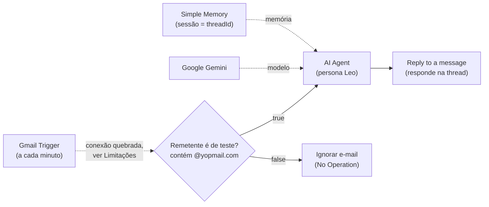
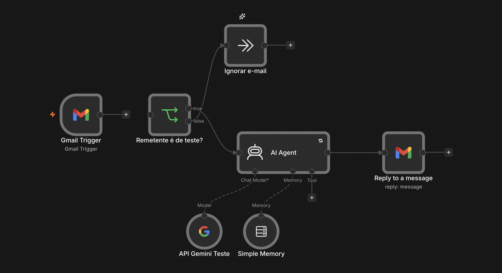

# Agente de e-mail para leads de escola online (EduVerso+)

> **Caso fictício.** A EduVerso+, seus cursos, preço, link e e-mail de suporte foram criados para estudo. Este fluxo não está em produção.

## Problema

Uma escola online recebe e-mails de pessoas interessadas nos cursos, com dúvidas sobre preço, conteúdo e formato, e objeções como "está caro" ou "não sei se consigo". Responder cada um manualmente é lento, e respostas incompletas fazem o interessado desistir.

O fluxo responde esses e-mails com um agente de IA que usa apenas as informações oficiais definidas no prompt, trata objeções comuns e sempre entrega o link de inscrição.

## Como funciona

1. **Gmail Trigger:** verifica a caixa de entrada a cada minuto e captura novos e-mails (modo completo, `simple: false`).
2. **Remetente é de teste? (If):** verifica se o endereço do remetente (`from.value[0].address`) contém `@yopmail.com`.
   - **true:** segue para o agente (modo de teste: só remetentes do Yopmail são respondidos);
   - **false:** vai para **Ignorar e-mail** (No Operation) e o fluxo termina.
3. **AI Agent:** recebe o texto do e-mail e gera a resposta seguindo o prompt de sistema (persona "Leo"). Usa:
   - **API Gemini Teste:** modelo Google Gemini;
   - **Simple Memory:** memória de conversa por `threadId`, janela de 20 mensagens.
4. **Reply to a message:** responde o e-mail original na mesma thread, com o HTML gerado e sem a assinatura do n8n.

## Tecnologias

- n8n (AI Agent, nós do LangChain, If, No Operation)
- Gmail (gatilho e resposta, OAuth2)
- Google Gemini (modelo de chat)
- Memória de conversa em janela (Simple Memory) indexada por `threadId`

## Destaques técnicos

- **Prompt com fonte única de verdade:** um bloco "Informações oficiais" concentra produto, preço, garantia, link de inscrição, suporte, formato, certificado e lista de cursos, com a instrução explícita de usar somente esses dados. Se o lead pedir um curso fora da lista, o agente indica o mais próximo ou o suporte.
- **Estrutura fixa de resposta:** responder a pergunta, conectar com os cursos relevantes, destacar 1 ou 2 diferenciais, incluir o link de inscrição e, opcionalmente, fazer uma pergunta curta.
- **Tratamento de objeções:** respostas-guia para "está caro", "vou pensar", "vi mais barato", "não sei se consigo" e "quero só 1 curso".
- **Guardrails:** escopo restrito, sem citar concorrentes, sem descontos além do preço oficial, sem pedir dados sensíveis (CPF, senha, cartão), calma com leads agressivos e encaminhamento ao suporte humano quando não souber a resposta.
- **Filtro de remetente de teste:** o If limita as respostas a endereços `@yopmail.com`, evitando que o agente responda e-mails reais durante os testes.
- **Memória por thread:** a sessão da memória é o `threadId` do Gmail, então o agente mantém o contexto dentro de cada conversa.
- **Respostas em HTML:** o prompt pede HTML válido (`<b>`, ` `, `<ul>/<li>`), 2 a 3 parágrafos curtos, com preço, garantia e nome do produto em negrito.
- **Tentativas automáticas:** o nó do agente está com `retryOnFail` (até 2 tentativas, 5 s entre elas).

## Como importar e testar

1. No n8n, vá em **Workflows → Import from File** e selecione `workflow.json`.
2. Crie as credenciais e associe-as aos nós:
   - **Gmail OAuth2:** nós `Gmail Trigger` e `Reply to a message`;
   - **Google Gemini (PaLM) API:** nó `API Gemini Teste`.
3. **Reconecte o `Gmail Trigger` ao nó `Remetente é de teste?`** (veja Limitações; no JSON exportado essa ligação está quebrada).
4. Crie um endereço em [yopmail.com](https://yopmail.com) e envie, a partir dele, um e-mail para a conta conectada perguntando sobre os cursos.
5. Acompanhe a execução no n8n e confira a resposta na caixa do Yopmail.

## Imagem do fluxo

## Limitações e próximos passos

Pontos encontrados na revisão do JSON exportado:

- **Gatilho desconectado (bug):** em `connections`, o `Gmail Trigger` aponta para um nó chamado `If`, que não existe mais, porque o nó foi renomeado para `Remetente é de teste?`. Resultado: o gatilho dispara, mas nada é executado depois dele. O print do fluxo mostra o `Gmail Trigger` sem ligação. Correção: religar o gatilho ao If no editor.
- **Expressão do remetente:** a condição do If usa `$json.from.value[0].address`, que é o formato correto quando o gatilho está com `simple: false`. Não há problema aqui.
- **Caminhos true/false:** não estão invertidos. E-mails de `@yopmail.com` (true) vão para o agente e os demais (false) vão para o "Ignorar e-mail". Isso é intencional para a fase de testes, mas significa que, como está, o fluxo nunca responde leads reais. Para usar de verdade, é preciso inverter a lógica ou trocar o If por um filtro de spam/remetentes bloqueados.
- **Dados da escola no prompt:** preço, link de inscrição, e-mail de suporte e lista de cursos estão definidos no próprio prompt (bloco "Informações oficiais"), o que reduz o risco de o agente inventar informação. Ainda assim, são dados fictícios e fixos no texto: qualquer mudança exige editar o prompt. Um próximo passo seria mover o catálogo para uma planilha ou base consultada por ferramenta.
- **Comparação sensível a maiúsculas:** o If está com `caseSensitive: true`; um remetente como `Teste@YOPMAIL.COM` não passaria no filtro.
- **Envio sem revisão humana:** a resposta vai direto para o lead. Uma alternativa é criar rascunho ou exigir aprovação.
- **Memória volátil:** a Simple Memory se perde ao reiniciar o n8n. Para uso contínuo, trocar por memória persistente.
- **Sem registro de leads:** diferente do [agente da imobiliária](../agente-email-imobiliaria/), este fluxo não salva os interessados em nenhuma planilha ou CRM.
