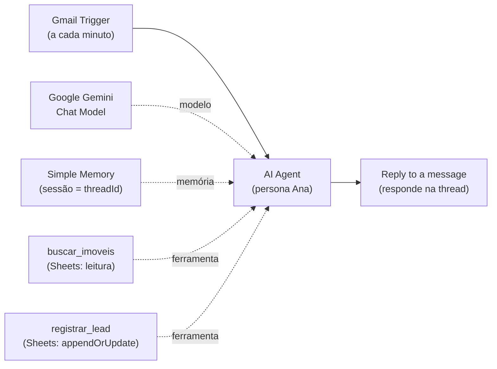
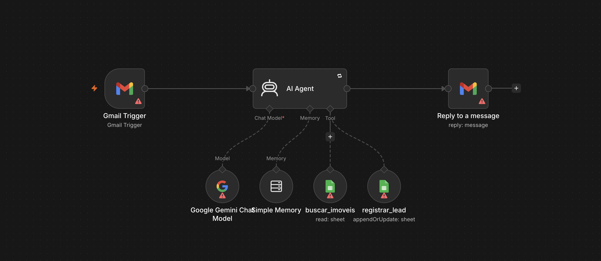

# Agente de e-mail para imobiliária (Nova Lar Imóveis)

> **Caso fictício.** A Nova Lar Imóveis, seus contatos, site e planilhas foram criados para estudo. Este fluxo não está em produção.

## Problema

Uma imobiliária recebe muitos e-mails com perguntas repetidas (documentação, processo de compra e aluguel, imóveis disponíveis) e precisa registrar quem demonstra interesse real. Responder tudo manualmente atrasa o primeiro contato e os leads se perdem no meio da caixa de entrada.

O fluxo responde esses e-mails automaticamente com um agente de IA, consulta os imóveis cadastrados em uma planilha e registra os leads interessados em uma planilha de CRM.

## Como funciona

1. **Gmail Trigger:** verifica a caixa de entrada a cada minuto e captura novos e-mails (modo completo, `simple: false`, que traz remetente, corpo em texto e `threadId`).
2. **AI Agent:** recebe o texto do e-mail e gera a resposta seguindo o prompt de sistema (persona "Ana"). O agente tem acesso a:
   - **Google Gemini Chat Model:** o modelo de linguagem;
   - **Simple Memory:** memória de conversa por `threadId`, com janela de 30 mensagens;
   - **buscar_imoveis:** ferramenta que lê a planilha de imóveis;
   - **registrar_lead:** ferramenta que cria ou atualiza o lead na planilha de CRM.
3. **Reply to a message:** responde o e-mail original, na mesma thread, com o HTML gerado pelo agente.

## Tecnologias

- n8n (AI Agent, nós do LangChain)
- Gmail (gatilho e resposta, OAuth2)
- Google Gemini (modelo de chat)
- Google Sheets (como ferramenta do agente: leitura e append/update)
- Memória de conversa em janela (Simple Memory) indexada por `threadId`

## Destaques técnicos

- **Prompt estruturado em seções:** quem é o agente (persona), tom de voz, o que pode fazer, informações da empresa, documentação, processo de compra e aluguel, perguntas frequentes (inclui respostas-padrão para negociação de preço, FGTS, pet e corretagem), uso das ferramentas, regras e formatação.
- **Limites claros:** o agente não pode inventar imóveis (precisa consultar `buscar_imoveis` antes de recomendar), redireciona assuntos fora do escopo com uma frase padrão, não fala mal de concorrentes e sugere visita pelo WhatsApp quando há interesse claro.
- **Critério para registrar lead:** o prompt diferencia interesse real de pergunta genérica ("qual o horário de vocês?") e só registra no primeiro caso.
- **Registro sem duplicar:** `registrar_lead` usa a operação `appendOrUpdate` com a coluna `E-mail` como chave. Se o e-mail já existe, a linha é atualizada; senão, uma nova é criada. O e-mail vem direto do remetente (`from.value[0].address`) e a data é preenchida por expressão; os demais campos são preenchidos pelo agente via `$fromAI()`.
- **Memória por thread:** a sessão da memória é o `threadId` do Gmail, então cada conversa por e-mail tem seu próprio histórico e o agente mantém o contexto entre respostas da mesma thread.
- **Respostas em HTML:** o prompt pede HTML válido (`<b>`, ` `, `<ul>/<li>`, `<a>`) e um bloco visual por imóvel recomendado.
- **Tentativas automáticas:** o nó do agente está com `retryOnFail` (até 2 tentativas, 5 s entre elas), para falhas temporárias da API do modelo.

## Como importar e testar

1. No n8n, vá em **Workflows → Import from File** e selecione `workflow.json`.
2. Crie as credenciais e associe-as aos nós:
   - **Gmail OAuth2:** nós `Gmail Trigger` e `Reply to a message`;
   - **Google Gemini (PaLM) API:** nó `Google Gemini Chat Model`;
   - **Google Sheets OAuth2:** nós `buscar_imoveis` e `registrar_lead`.
3. Crie as duas planilhas no Google Sheets e substitua `https://docs.google.com/spreadsheets/d/SEU_ID_AQUI` pelo link de cada uma nos nós correspondentes (a aba usada é a primeira, `gid=0`).
4. Use uma conta de Gmail de teste: o gatilho não tem filtros e o agente vai responder **todo** e-mail novo que chegar.
5. Envie um e-mail para essa conta perguntando por um imóvel e acompanhe a execução no n8n.

### Planilha de leads (`registrar_lead`)

A primeira linha deve ter exatamente estes cabeçalhos (tirados do mapeamento do nó):

| Data | Nome | E-mail | Telefone | Interesse (Compra/Aluguel) | Região de Preferência | Quartos | Orçamento Máximo (R$) | Imóvel de Interesse (ID) | Resumo da Conversa | Status | Próximo Passo |
|---|---|---|---|---|---|---|---|---|---|---|---|

### Planilha de imóveis (`buscar_imoveis`)

O nó apenas lê a planilha inteira, então o JSON não define colunas obrigatórias. O prompt, porém, pressupõe pelo menos uma coluna **ID** (usada no registro do lead) e uma coluna **Pet Friendly**. Colunas como bairro, tipo, finalidade (venda/aluguel), quartos e preço ajudam o agente a filtrar, mas são sugestão, não exigência do fluxo.

## Imagem do fluxo

## Limitações e próximos passos

- **Sem filtro no gatilho:** qualquer e-mail recebido (newsletter, notificação, spam) aciona o agente e recebe resposta. Próximo passo: filtrar por rótulo, remetente ou assunto, ou adicionar uma etapa de classificação antes do agente.
- **Verificação de lead existente:** o prompt pede para o agente conferir se o e-mail já está na planilha de leads, mas ele não tem ferramenta de leitura dessa planilha. Na prática, quem evita a duplicação é o `appendOrUpdate` com chave `E-mail`. O agente também não enxerga o `Status` atual do lead, então pode sobrescrevê-lo.
- **Leitura da planilha inteira:** `buscar_imoveis` traz todas as linhas a cada consulta. Funciona para uma planilha pequena, mas não escala bem.
- **Assinatura do n8n:** o nó de resposta não desativa `appendAttribution`, então o n8n acrescenta a assinatura padrão no fim do e-mail.
- **Envio sem revisão humana:** a resposta vai direto para o cliente. Uma opção é gerar rascunho em vez de responder, ou exigir aprovação em casos específicos.
- **Memória volátil:** a Simple Memory fica na memória do n8n e se perde ao reiniciar a instância. Para uso contínuo, trocar por uma memória persistente (Postgres, Redis).
- **Modelo padrão:** o nó do Gemini não fixa um modelo específico; vale definir explicitamente para ter comportamento previsível.
