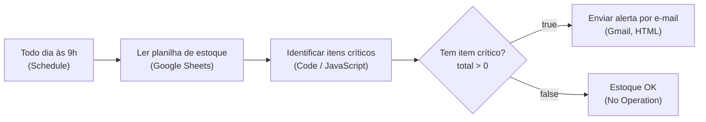
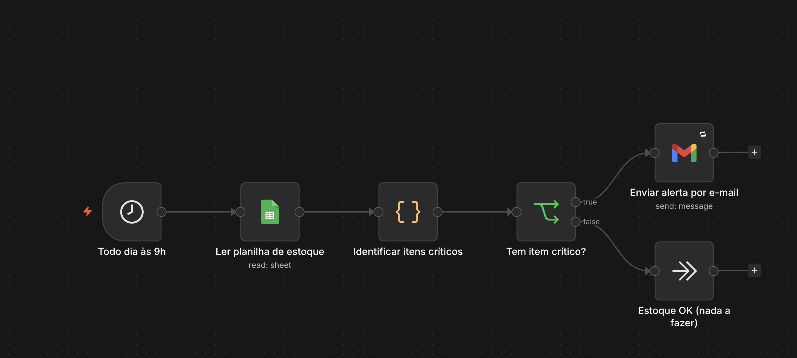

# Alerta de estoque crítico

> **Caso de estudo.** A planilha, os produtos e o destinatário (`responsavel.compras@exemplo.com`) são fictícios. Este fluxo não está em produção.

## Problema

Quando o controle de estoque fica numa planilha, alguém precisa abrir e conferir item por item para descobrir o que está acabando. Se ninguém olha, a falta só é percebida quando o produto já zerou.

O fluxo faz essa conferência todos os dias e manda um e-mail para o responsável por compras apenas quando existe algum item no estoque mínimo ou abaixo dele.

## Como funciona

1. **Todo dia às 9h (Schedule Trigger):** dispara o fluxo uma vez por dia.
2. **Ler planilha de estoque (Google Sheets):** lê todas as linhas da aba `Estoque`.
3. **Identificar itens críticos (Code, JavaScript):**
   - converte `Quantidade` e `Estoque Minimo` para número, aceitando formato brasileiro (`1.234,5`);
   - ignora linhas sem `Produto` e separa as que têm valores ilegíveis;
   - considera crítico todo item com quantidade **menor ou igual** ao mínimo e calcula quanto falta;
   - ordena com os zerados primeiro e depois pelos que estão mais abaixo do mínimo;
   - monta o assunto e uma tabela HTML (linhas zeradas em vermelho), com um aviso sobre as linhas ilegíveis.
4. **Tem item crítico? (If):** verifica se `total > 0`.
   - **true:** **Enviar alerta por e-mail** (Gmail) envia o relatório em HTML;
   - **false:** **Estoque OK (nada a fazer)** (No Operation) e o fluxo termina.

## Tecnologias

- n8n (Schedule Trigger, Code, If, No Operation)
- Google Sheets (leitura)
- Gmail (envio, OAuth2)
- JavaScript no nó Code

Este fluxo **não usa IA**: a regra de negócio é determinística e fica toda no nó Code.

## Destaques técnicos

- **Toda a lógica em um só nó Code:** o nó recebe todas as linhas de uma vez (`$input.all()`) e devolve um único item com `total`, `zerados`, `assunto` e `html`. Assim o If e o Gmail trabalham com um resumo pronto, sem loop.
- **Normalização de números:** a função `num()` aceita números nativos e textos no formato brasileiro, e marca como inválido o que não consegue converter.
- **Priorização no relatório:** itens zerados aparecem primeiro e destacados; os demais vêm ordenados por quantidade faltante.
- **Aviso de dados ruins:** produtos com quantidade ou mínimo ilegível são listados no fim do e-mail, em vez de sumirem sem aviso.
- **E-mail só quando precisa:** o If evita mandar e-mail nos dias em que está tudo certo.
- **Tentativas automáticas:** o nó do Gmail está com `retryOnFail` (até 3 tentativas, 5 s entre elas) e sem a assinatura do n8n.

## Como importar e testar

1. No n8n, vá em **Workflows → Import from File** e selecione `workflow.json`.
2. Crie as credenciais e associe-as aos nós:
   - **Google Sheets OAuth2:** nó `Ler planilha de estoque`;
   - **Gmail OAuth2:** nó `Enviar alerta por e-mail`.
3. Crie uma planilha com uma aba chamada **`Estoque`** e estes cabeçalhos na primeira linha (os nomes precisam ser exatamente estes, sem acento em "Minimo"):

   | Produto | SKU | Quantidade | Estoque Minimo |
   |---|---|---|---|

4. Substitua `https://docs.google.com/spreadsheets/d/SEU_ID_AQUI` pelo link da sua planilha.
5. Troque o destinatário `responsavel.compras@exemplo.com` no nó do Gmail pelo seu e-mail.
6. Deixe pelo menos um item com quantidade menor ou igual ao mínimo e clique em **Execute Workflow** para testar sem esperar as 9h.

## Imagem do fluxo

## Limitações e próximos passos

Pontos encontrados na revisão do JSON e em testes da função `num()` do nó Code:

- **Célula de quantidade vazia vira zero:** `Number("")` retorna `0`. Um produto com `Quantidade` em branco é tratado como **zerado** e gera alerta, em vez de entrar na lista de valores ilegíveis. Correção: tratar texto vazio como inválido.
- **Decimal com ponto é lido errado:** a função remove todos os pontos antes de trocar a vírgula, então `"12.5"` vira `125`. Com a planilha em português (`12,5`) funciona; em uma planilha com localidade em inglês, a leitura sai errada.
- **Linhas ilegíveis podem passar despercebidas:** o aviso sobre valores inválidos só vai no e-mail quando existe pelo menos um item crítico. Se nenhum item estiver crítico, o fluxo termina sem avisar sobre as linhas com problema.
- **Fuso horário:** o fluxo não define timezone nas configurações, então "9h" segue o fuso padrão da instância do n8n. Em uma instância em UTC, o disparo acontece às 6h de Brasília. Próximo passo: definir `America/Sao_Paulo` nas configurações do workflow.
- **Alerta repetido todo dia:** enquanto o item não for reposto, o mesmo alerta chega diariamente, inclusive no fim de semana. Dá para registrar o último alerta por item ou rodar só em dias úteis.
- **Destinatário fixo:** o e-mail está escrito direto no nó. Poderia vir de uma variável ou de uma aba de configuração.
- **HTML sem escape:** nomes de produto e SKU entram na tabela sem escapar caracteres como `<` e `&`, o que pode quebrar a formatação do e-mail.
- **Leitura da planilha inteira:** funciona bem para estoques pequenos e médios; para bases grandes, o ideal seria um banco de dados.
